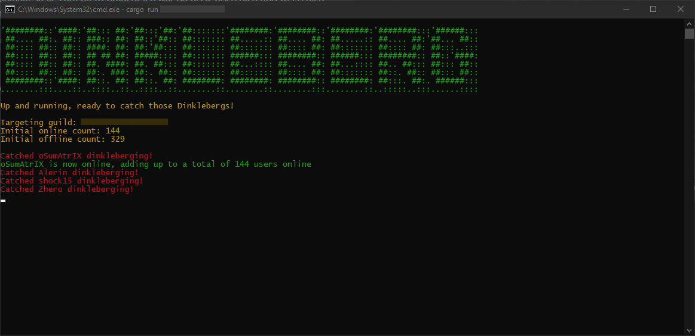

<div align="center">

# Dinkleberg

Catch users faking their offline status on discord


<br>
 
 [](https://github.com/oSumAtrIX/dinkleberg/actions/workflows/rust.yml)
 [](https://www.codacy.com/gh/oSumAtrIX/dinkleberg/dashboard?utm_source=github.com&amp;utm_medium=referral&amp;utm_content=oSumAtrIX/dinkleberg&amp;utm_campaign=Badge_Grade)
 [](https://github.com/oSumAtrIX/dinkleberg/stargazers)
 [](https://github.com/oSumAtrIX/dinkleberg/issues)
 [](https://masterminds.github.io/stability/active.html)
 [](https://github.com/oSumAtrIX/dinkleberg/blob/main/LICENSE)
</div>

## About

Dinkleberg is a discord bot written in Rust to assist tracking of users online status.
Technically you do not depend on a discord bot token and a discord user token can be used instead if the code is modified properly to support it.
It can detect if a user is offline, or really just pretending when the user sets its status to invisible on discord.

## Preview



## Disclaimer

```text
Dinkleberg was developed for educational, private and fair use.
I am not responsible in any way for the usage of the source code.
```

## Features

-   Rust
-   Automatically track an entire guild and its users
-   Filter for specific users
-   Fancy colored output
-   Find out who really goes offline or just pretends to
-   Easy to use

## Building

Clone the repository using git and change to the local repository directory:

```bash
git clone https://github.com/oSumAtrIX/dinkleberg.git
cd dinkleberg
```

`Nightly Rust` is required to build this project. Install it by following [rustup.rs](https://rustup.rs) instructions.

```bash
cargo build --release
```

## Bot setup

The bot needs the following gateway intents to operate.

- `GUILD_PRESENCES`

- `GUILD_MEMBERS`

## Environment variables

To use this project you will need to set the following environment key with your discord token as the value:

- `DISCORD_TOKEN`

## Settings

A default `settings.json` file will be generated when running the program at the first time.

- On big discord servers (+999 members), it is recommended to use the official API since more rate-limiting applies to the widget endpoint. On the other hand, the official discord API is way less reliable and may cause more false detections, so it is recommended to use the widget as much as possible.
For that, widgets must be enabled in the targets discord server settings under `Server Settings > Widget > Enable server widget`.

- Set `use_widget` in the `settings.json` to false to use the discord bot API endpoint instead.

- Adding user ids to `include_only` list, separated by a comma, will only track those users. Leaving it empty as-is will track all users in the targeted guild. Filtering helps with rate limiting and false detection a lot and should be considered to be used.

- Increase the `sleep_timer` if discord is too slow to update changes on the member count.

## Usage/ Examples

```text
$ dinkleberg.exe

'########::'####:'##::: ##:'##:::'##:'##:::::::'########:'########::'########:'########:::'######:::
 ##.... ##:. ##:: ###:: ##: ##::'##:: ##::::::: ##.....:: ##.... ##: ##.....:: ##.... ##:'##... ##::
 ##:::: ##:: ##:: ####: ##: ##:'##::: ##::::::: ##::::::: ##:::: ##: ##::::::: ##:::: ##: ##:::..:::
 ##:::: ##:: ##:: ## ## ##: #####:::: ##::::::: ######::: ########:: ######::: ########:: ##::'####:
 ##:::: ##:: ##:: ##. ####: ##. ##::: ##::::::: ##...:::: ##.... ##: ##...:::: ##.. ##::: ##::: ##::
 ##:::: ##:: ##:: ##:. ###: ##:. ##:: ##::::::: ##::::::: ##:::: ##: ##::::::: ##::. ##:: ##::: ##::
 ########::'####: ##::. ##: ##::. ##: ########: ########: ########:: ########: ##:::. ##:. ######:::
........:::....::..::::..::..::::..::........::........::........:::........::..:::::..:::......::::

Usage: dinkleberg.exe <guild_id>
```

## Known issues

-   Possibility to false detect mobile discord clients (mobile client reports status too late)

## Authors

-   [@oSumAtrIX](https://osumatrix.me/#github)

## License

[GPL3](https://choosealicense.com/licenses/agpl-3.0/)
